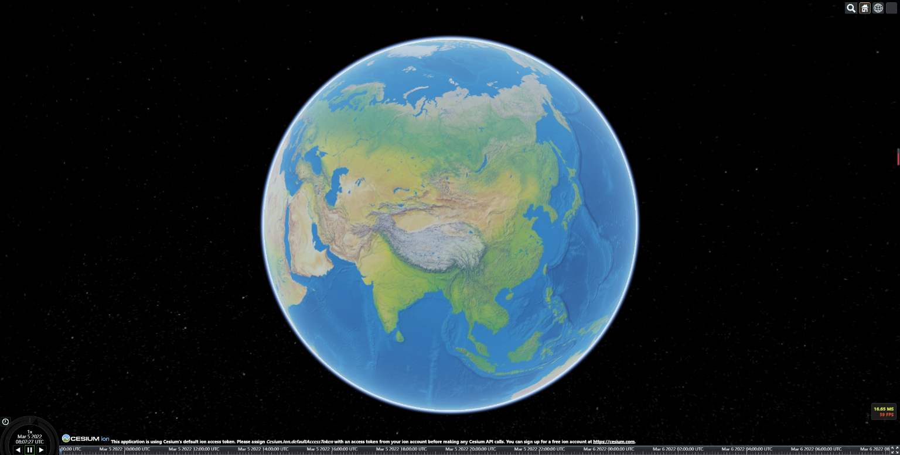

# `lit-cesium`

支持`web components`的、使用`ES6`、`rollup`的`Cesium`三维数字地球配置方案。支持开发环境模块热加载、浏览器调试`Cesium`源码。

2022年3月5日 当前只是初始化三维地球，暂无计划做更多功能。




## 简介

#### 组织结构

**使用[open-wc](https://github.com/open-wc) 初始化的特性**

1. 集成[`lit`](https://github.com/lit/lit) (web组件)

   > Lit is a simple library for building fast, lightweight web components.

2. 使用[`rollup`](https://rollupjs.org/guide/en/)

   > Rollup is a module bundler for JavaScript which compiles small pieces of code into something larger and more complex, such as a library or application. 

3. 使用[`web-dev-server`](https://github.com/web-dev-server/web-dev-server)，配置支持热加载，支持`ES6`代码在浏览器环境运行调试

   > Node.js simple http server for common development or training purposes.

4. 支持`storybook`和测试（我删掉了）

   > Storybook is an open source tool for building UI components and pages in isolation. It streamlines UI development, testing, and documentation.

5. 使用`husky`配置git提交前任务，执行`eslint`和`prettier`代码格式化

6. `editorconfig`配置等等


#### `Cesium.js`说明

> An open-source JavaScript library for world-class 3D globes and maps 

`Cesium`库本身依赖众多资源文件和内部众多`worker.js` 。所以支持开发环境和打包的配置有一点点复杂，其中Cesium提供了一个[`cesium-webpack-example`](https://github.com/CesiumGS/cesium-webpack-example)的应用示例可以参考。


#### 我做了什么

使用`open-wc`，删除了`storybook`和测试相关文件，调整配置`Cesium`。该示例启动时加载提示，初始化完地球以后飞行到指定视角。

#####  

## 使用

```
npm install

npm run start
```

##### 可用脚本

```
npm run lint

npm run format

npm run build

npm run start:build
```


邮箱:iwuang@qq.com
